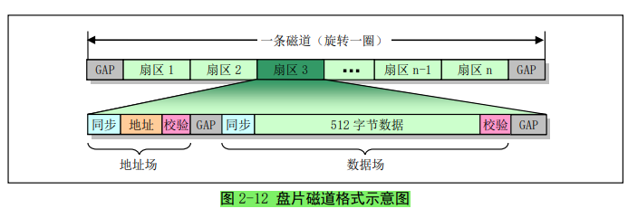
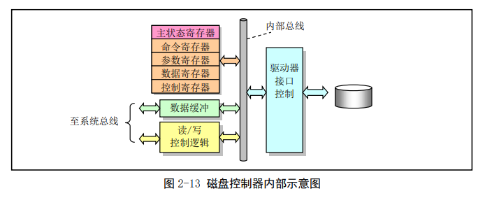

# Linux内核完全注释-笔记

# 2 微型计算机组成结构


## 2.1 微型计算机组成原理


## 2.2 I/O 端口寻址和访问控制方式

### 2.2.1I/O 端口和寻址

CPU 为了访问 I/O 接口控制器或控制卡上的数据和状态信息，需要首先指定它们的地址。这种地址就
称为 I/O 端口地址或者简称端口

端口地址的设置方法一般有两种：

- 统一编址
  - 端口统一编址的原理是把 I/O 控制器中的端口地址归入存储器寻址地址空间范围内。因此这种编址方
    式也成为存储器映像编址。
  - CPU 访问一个端口的操作与访问内存的操作一样，也使用访问内存的指令。
- 独立编址。
  - 端口独立编址的方法是把 I/O 控制器和控制卡的寻址空间单独作为一个独立的地址空间对待，称为 I/O 地址空间。
  - 每个端口有一个 I/O 地址与之对应，并且使用专门的 I/O 指令来访问端口。


在普通 Linux 系统下通过查看`/proc/ioports` 文件可以得到相关控制器或设置使用的 I/O 地址范围


### 2.2.2接口访问控制

PC 机 I/O 接口数据传输控制方式

- 程序循环查询方式
- 中断处理方式
  - 中断处理控制方式需要有中断控制器的支持。
  - 在 I/O 控制器或设备发出中断请求时，CPU通过使用中断向量表（或中断描述符表）来寻址相应的中断处理服务过程的入口地址。
-  DMA 传输方式
  - 直接存储器访问 DMA（Direct Memory Access）方式用于 I/O 设备与系统内存之间进行批量数据传送，整个操作过程需要使用专门的 DMA 控制器来进行而无需 CPU 插手。


## 2.3 主存储器、BIOS 和 CMOS 存储器

典型 PC 机上通常含有三种类型的存储器

- 运行程序和临时保存数据的内存存储器
- 系统开机诊断和初始化硬件程序的 ROM
- 计算机实时时钟信息和系统硬件配置信息的少量 CMOS 存储器


### 2.3.1主存储器

 RAM 主存储器（简称内存）


### 2.3.2基本输入/输出程序 BIOS

存放在 ROM 中的**系统 BIOS 程序**主要用于

- 计算机开机时执行系统各部分的自检，建立起操作系统需要使用的各种配置表
- 把处理器和系统其余部分初始化到一个已知状态
- 还为 DOS 等操作系统提供硬件设备接口服务


最后 BIOS 就会从硬盘或其他块设备把操作系统引导程序加载到内存 0x7c00 处，并跳转到这个地方继续执行引导程序。


### 2.3.3CMOS 存储器

CMOS（Complementary Metal Oxide Semiconductor，互补金属氧化物半导体）存储器来存放计算机的
实时时钟信息和系统硬件配置信息。


## 2.4 控制器和控制卡

一台 PC 中包含多种控制卡和控制器，用来传输数据和控制计算机运行。

- “控制器”是指集成在计算机主板上的控制部件
- “控制卡”则是指通过扩展槽插入计算机的控制卡部件


### 2.4.1中断控制器

用两片级联的 8259A 可编程中断控制芯片组成一个**中断控制器**

- 用于实现 I/O 设备的中断控制数据存取方式，并且能为 15 个设备提供独立的中断控制功能
- 在计算机刚开机初始化期间，ROM BIOS 会对这两片 8259A 芯片进行初始化，并分别把 15 级中断优先级分配给时钟定时器、键盘、串行口、打印口、软盘控制、协处理器和硬盘等设备或控制器使用
- 同时在内存开始处 0x000-0xFFF 区域内建立一个中断向量表，并把这些中断请求映射到了从 0x08 开始的中断向量号上


### 2.4.2DMA 控制器

DMA 控制器

- 主要功能是通过让外部设备直接与内存传输数据来增强系统的性能。
- 通过对 DMA 控制器进行编程，外设与内存之间的数据传输能在不受 CPU 控制的条件下进行。


### 2.4.3定时/计数器

Intel 8253/8254 是一个**可编程定时/计数器（PIT - Programmable Interval Timer）芯片**，用于处理计算机中的精确时间延迟。

- 在延时到后，8253/8254 将会向 CPU 发送一个中断信号。
- Linux 0.12 操作系统只对通道 0 进行了重新设置，使得该计数器工作在方式 3 下，并且每间隔 10 毫秒发出一个信号以产生中断请求信号（IRQ0）。
- 这个间隔定时产生的中断请求就是 Linux 0.12 内核工作的脉搏，它用于定时切换当前执行的任务和统计每个
  任务使用的系统资源量（时间）。


### 2.4.4键盘控制器

键盘上有一个称为**键盘编码器**的处理器（Intel 8048 或兼容芯片）专门用来扫描收集所有按键按下和松开的**状态信息（即扫描码）**，并发送到主机主板上**键盘控制器**中。

- 当一个键被按下时，键盘发送的扫描码称为接通扫描码（Make code），或简称为接通码
- 当一个被按下的键放开时发送的扫描码被称为断开扫描码（Break code），或简称为断开码


主机**键盘控制器**专门用来对接收到的**键盘扫描码**进行**解码**，并把**解码后的数据**发送到操作系统的**键盘数据队列中**。

整个键盘上所有按键的接通和断开码就组成了键盘的一个**扫描码集（Scan Code Set）**。


键盘控制器在收到 11 位的串行数据后就将键盘扫描码转换成PC/XT 标准键盘兼容的系统扫描码，然后通过中断控制器 IRQ1 引脚向 CPU 发送中断请求。当 CPU 响应该中断请求后，就会调用键盘中断处理程序来读取控制器中的 XT 键盘扫描码。


### 2.4.5串行控制卡

1. 异步串行通信原理

把计算机/设备与计算机/设备之间的“语言”称为通信协议。

- 通信协议规定了传送一个有效数据长度单位的格式。使用术语“帧”来形容这种格式。
- 为了能让通信双方**确定收/发的顺序**和进行一些**错误检测**操作，除了必要的数据以外，在传输的一帧信息中还包含起同步和错误检测作用的其它信息


串行通信是指在线路上以比特位数据流一次一个比特进行传输的通信方式。**串行通信**可分为**异步**和**同步**串行通信两种类型。它们之间的主要区别在于传输时**同步的通信单位或帧的长度**不同。

- **异步串行通信**以**一个字符**作为一个通信单位或**一帧**进行传输
- **同步串行通信**则以**多个字符或字节组成的序列**作为一帧数据进行传输。


2. 异步串行传输格式

异步串行通信传输的**帧格式**。在异步通信规范中，把传送 1 称为传号（MARK），传送 0 称为空号（SPACE）。


在接收一字符帧时，接收方可能会检测到三种错误之一：①奇偶校验错误。②过速错误。③帧格式错误。


3. 串行控制器

为实现串行通信，PC 机上通常都带有 2 个符合 RS-232C 标准的串行接口，并使用**通用异步接收/发送器控制芯片 UART（Universal Asyncronous Receiver/Transmitter）组成的串行控制器来**处理串行数据的收发工作。


### 2.4.6显示控制

1. MDA 显示标准

单色显示适配器 MDA（Monochrome Display Adapter）仅支持黑白两色显示。

- 其屏幕显示规格是 80 列 X 25 行（列号 x = 0..79；行号 y = 0..24），共可显示 2000 个字符。

- 每个字符还带有 1 个属性字节，因此显示一屏（一帧）内容需要占 4KB 字节。偶地址字节存放字符代码，奇地址字节存放显示属性。

- 在 PC 机内存寻址范围中占用从 0xb0000 开始的 8KB 空间（0xb0000 -- 0xb2000）

- 位于屏幕列行值 x、y 处的**字符和属性**在**内存中的位置**是

  ```bash
  字符字节位置 = 0xb0000 + video_num_colums * 2 * y + x * 2；
  属性字节位置 = 字符字节位置 + 1；
  ```


2. CGA 显示标准

**彩色图形适配器 CGA（Color Graphics Adapter）**支持 7 种彩色和图形显示方式

- CGA卡标配有 16KB 显示内存（占用内存地址范围 0xb8000 -- 0xbc000），因此其中共可存放 4 帧显示信息。
- 在每一帧 4KB 显示内存中，偶地址字节存放字符代码，奇地址字节存放字符显示属性。


3. EGA/VGA 显示标准

增强型图形适配器 EGA（Enhanced Grpahics Adapter）和视频图形阵列 VGA（Video Graphics Adapter）除兼容或支持 MDA 和 CGA 的显示方式以外，还支持其他在图形显示方面的增强显示方式。


### 2.4.7软盘和硬盘控制器

PC 机的**软盘控制子系统**由软盘片和软盘驱动器组成。硬盘也是由盘片和驱动器组成。软盘和硬盘都是利用磁性介质保存信息，具有类似的存储工作方式。

在盘片上存储数据的基本方式是利用盘片表面上的一层磁性介质在磁化后的剩磁状态。


一张软盘中含有一张聚酯薄膜圆盘片，使用上下两个磁头在盘片两面读写数据


硬盘中通常起码包括 2 张或者更多张金属盘片，因此具有两个以上的读写磁头。





为了读写磁盘（软盘和硬盘）上的数据，就必须使用**磁盘控制器**。

- 磁盘控制器是 CPU 与驱动器之间的逻辑接口电路
- 它从 CPU 接收请求命令，向驱动器发送寻道、读/写和控制信号，并且控制和转换数据流形式。
- 控制器必须从实际读/写数据中分离出这些地址信息和一些编码、解码等控制信息。
- 与驱动器之间的数据传输是串行比特数据流，因此控制器需要在并行字节数据和串行比特流数据之间进行转换。



对**磁盘控制器**的编程过程就是通过 **I/O 端口**设置控制器中的相关寄存器内容，并通过寄存器获取操作的结果信息。


# 3 内核编程语言和环境


